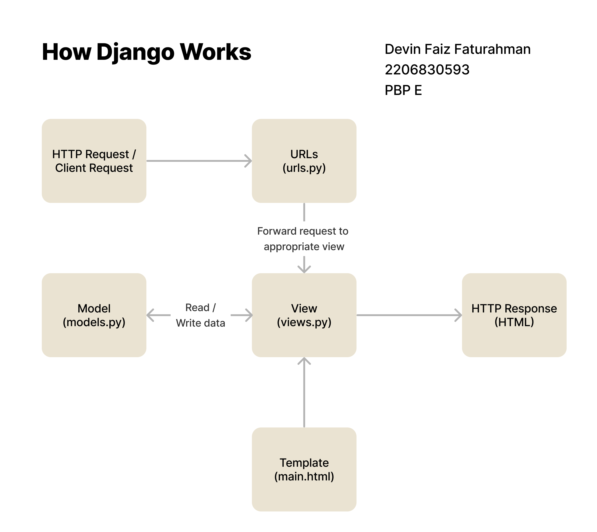
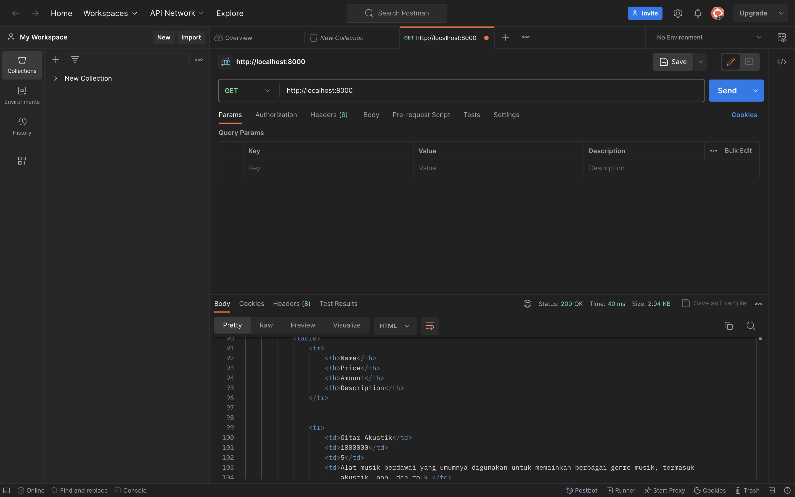
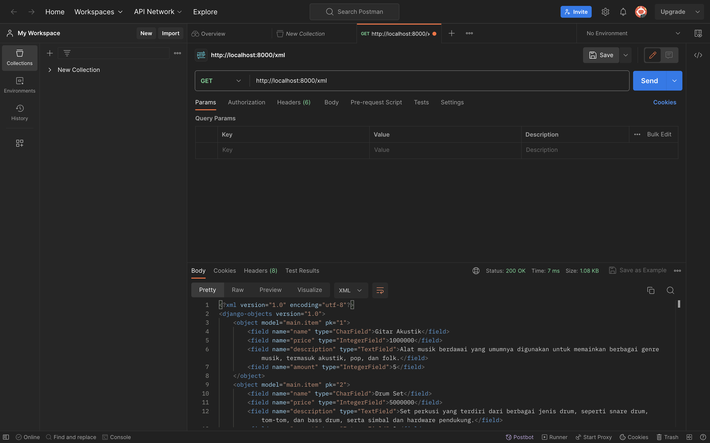
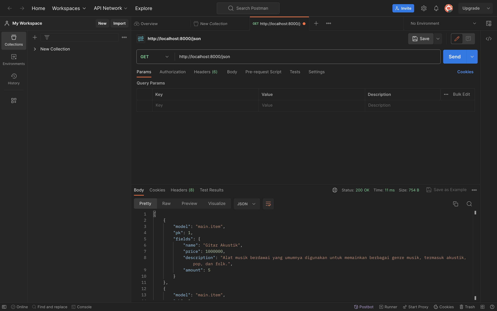
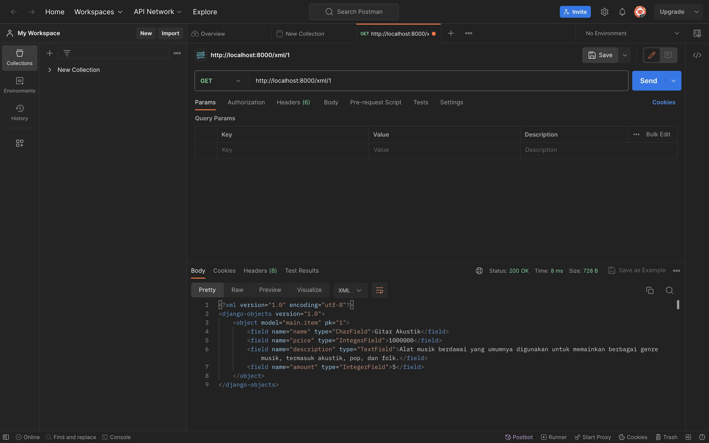
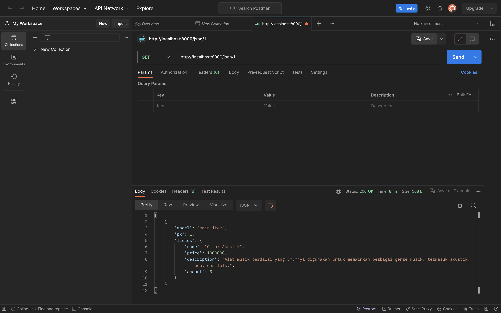
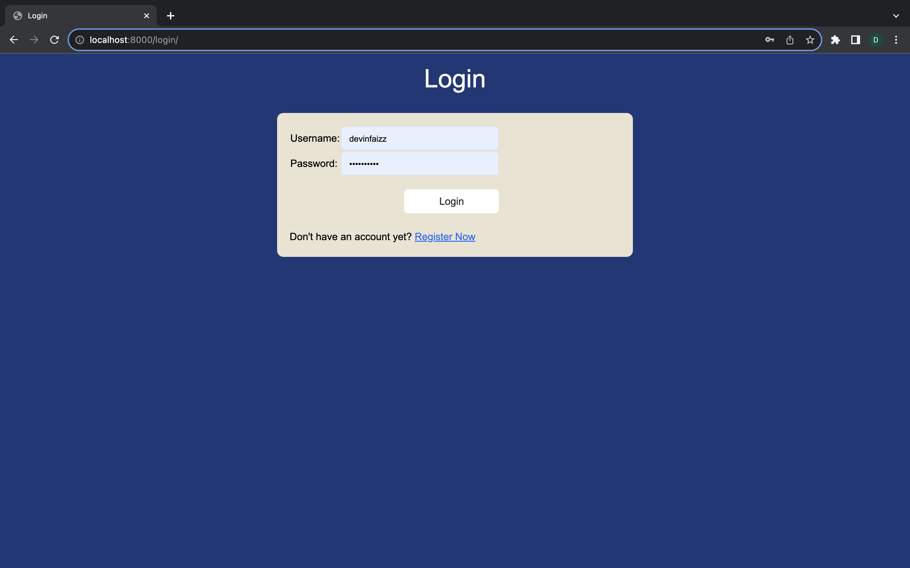
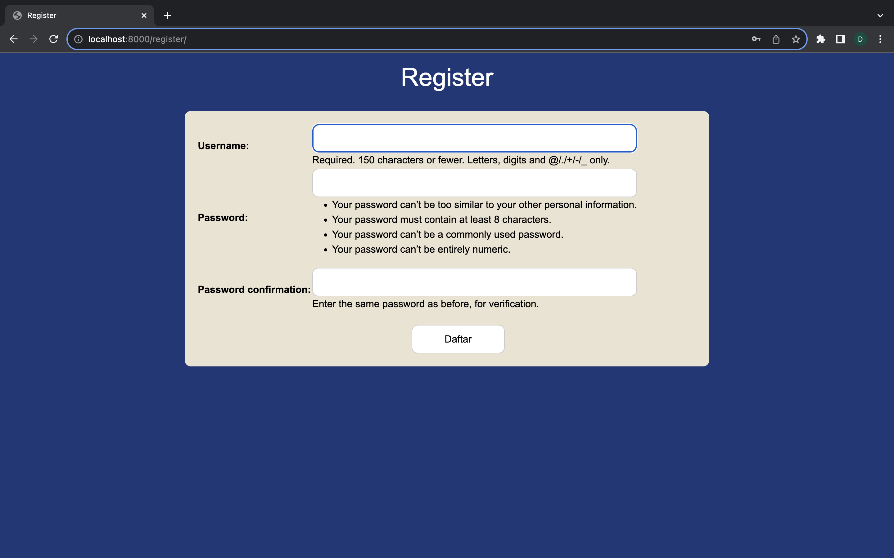
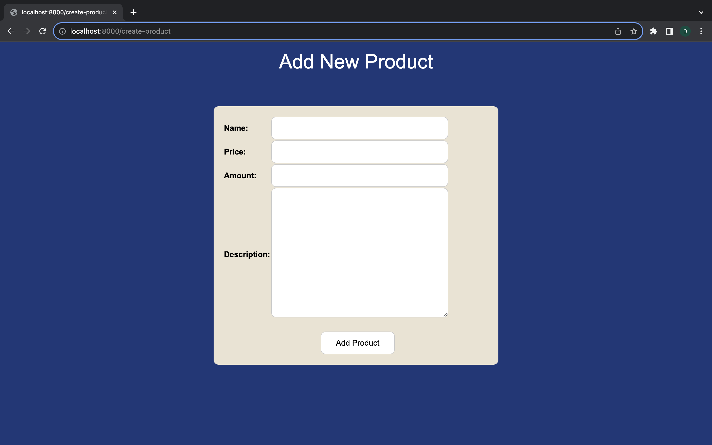
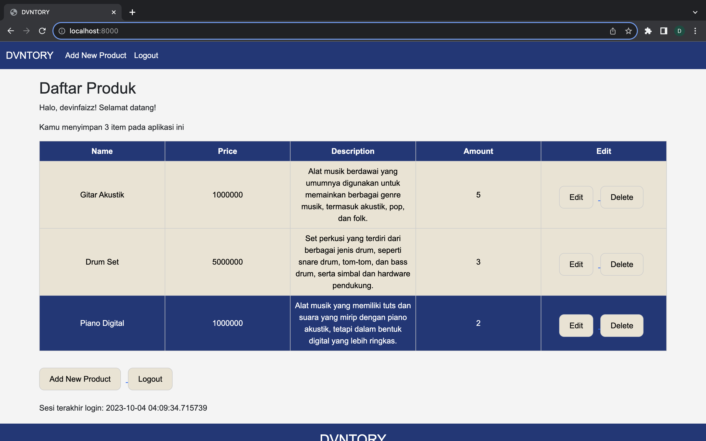

# **DVNTORY**

Devin Faiz Faturahman 2206830593 PBP E

Tautan untuk mengakses web di adaptable, [klik tautan ini](https://dvntory.adaptable.app)

# Tugas 2
## Membuat sebuah proyek Django baru
1. Mulai dengan membuat direktori baru sesuai keinginan. Membuat direktori bernama `dvntory` dan buka terminal shell di dalam direktori tersebut.
2. Selanjutnya, buat virtual environment dengan perintah `python3 -m venv env` untuk mengisolasi proyek Python. Aktifkan virtual environment dengan menjalankan perintah `source env/bin/activate` (pengguna Mac).
3. Buat file `requirements.txt` di dalam direktori proyek dan isi dependencies yang diperlukan untuk proyek.
4. Install semua dependencies dengan menjalankan perintah `pip install -r requirements.txt`. Selanjutnya, buat proyek Django dengan perintah `django-admin startproject dvntory`.
5. Buka file `settings.py`. Cari variabel "ALLOWED_HOSTS" dan ubah isinya menjadi ["*"].
6. Buka terminal lalu jalankan server dengan perintah `python manage.py runserver` di dalam direktori proyek.
7. Proyek Django yang baru telah berhasil dibuat, buka proyeknya dalam link ini http://localhost:8000. Jika tidak error dan muncul gambar roket, maka proyek Django berhasil.
8. Hentikan server dengan menekan `Ctrl+C` di terminal. Menonaktifkan virtual environment dengan perintah `deactivate`.

## Membuat aplikasi dengan nama main pada proyek tersebut.
1. Buka terminal di direktori utama dan aktifkan virtual environment dengan perintah `source env/bin/activate`.
2. Jalankan perintah `python3 manage.py startapp main` untuk membuat folder baru bernama main.
3. Buka file settings.py di direktori proyek dan tambahkan 'main' pada variabel INSTALLED_APPS.

## Membuat model pada aplikasi main
1. Ubah file models.py yang terdapat di dalam direktori aplikasi main untuk mendefinisikan model baru dengan nama Item dan memiliki atribut wajib di bawah ini.
- `name` sebagai nama item dengan tipe CharField.
- `amount` sebagai jumlah item dengan tipe IntegerField.
- `description` sebagai deskripsi item dengan tipe TextField.
Diperbolehkan untuk menambah atribut jika diinginkan.
2. Isi file models.py dengan kode berikut.
```py
from django.db import models

class Item(models.Model):
    name = models.CharField(max_length=255)
    price = models.IntegerField()
    description = models.TextField()
    amount = models.IntegerField()
```

3. Lakukan migrasi model dengan menjalankan perintah `python3 manage.py makemigrations` lalu jalankan perintah `python3 manage.py migrate`.

## Membuat sebuah fungsi pada views.py untuk dikembalikan ke dalam sebuah template HTML
1. Buat direktori baru dengan nama `templates` di dalam direktori aplikasi `main`, lalu buat file `main.html` di dalamnya.
2. Buka file `views.py` yang ada di direktori `main` lalu tambahkan baris kode di paling atas `from django.shortcuts import render`.
3. Buat fungsi `show_main` dengan menggunakan 1 parameter, dan isi seperti contoh di bawah ini.
```py
from django.shortcuts import render

def show_main(request):
    context = {
        'item_inventory' : [
            {
                'name': 'Gitar Akustik',
                'amount': '5',
                'description': 'Alat musik berdawai yang umumnya digunakan untuk memainkan berbagai genre musik, termasuk akustik, pop, dan folk.',
                'price': '1000000'  
            },
            {
                'name': 'Drum Set',
                'amount': '3',
                'description': 'Set perkusi yang terdiri dari berbagai jenis drum, seperti snare drum, tom-tom, dan bass drum, serta simbal dan hardware pendukung.',
                'price': '5000000'  
            },
            {
                'name': 'Piano Digital',
                'amount': '2',
                'description': 'Alat musik yang memiliki tuts dan suara yang mirip dengan piano akustik, tetapi dalam bentuk digital yang lebih ringkas.',
                'price': '1000000'  
            },
            {
                'name': 'Saxophone',
                'amount': '6',
                'description': 'Alat musik tiup logam dengan berbagai jenis, seperti alto, tenor, dan soprano. Biasanya digunakan dalam jazz dan musik klasik.',
                'price': '4000000'  
            },
            {
                'name': 'Biola',
                'amount': '8',
                'description': 'Instrumen dawai yang dimainkan dengan menggunakan busur. Biasanya digunakan dalam musik klasik.',
                'price': '1000000'  
            },
        ],
    }

    return render(request, "main.html", context)
```
4. Buka file `main.html`, ubah kode yang tadinya statis menjadi kode Django yang sesuai.

## Membuat sebuah routing pada urls.py aplikasi main untuk memetakan fungsi yang telah dibuat pada views.py
Jika belum ada, buat file urls.py pada direktori main dan buka file tersebut. Import path dari django.urls dan import views dari views.py. Seperti contoh di bawah ini.
```py
from django.urls import path
from main.views import show_main

app_name = 'main'

urlpatterns = [
    path('', show_main, name='show_main'),
]
```

## Melakukan routing pada proyek agar dapat menjalankan aplikasi main.
1. Buka file urls.py pada direktori proyek dvntory dan import modul include dari django.urls.
2. Tambahkan path yang akan mengarahkan ke aplikasi 'main' di dalam variabel urlpatterns. Seperti contoh di bawah ini.
```py
urlpatterns = [
    path('admin/', admin.site.urls),
    path('main/', include('main.urls')),
    path('', include('main.urls')),
]
```

## Cara deployment aplikasi ke Adaptable
1. Setelah berhasil login, pilih opsi `New App` dan kemudian pilih `Connect an Existing Repository`.
2. Sambungkan Adaptable.io dengan akun GitHub.
3. Pilih repositori proyek aplikasi dan branch yang akan digunakan untuk proses deployment.
4. Pilih template deployment `Python App Template` dan pilih `PostgreSQL`.
5. Sesuaikan versi Python dengan menggunakan perintah `python3 --version` di terminal.
6. Di bagian `Start Command,` masukkan `python3 manage.py migrate && gunicorn dvntory.wsgi`.
7. Beri nama aplikasi dan nama domain situs web.
8. Aktifkan opsi `HTTP Listener on PORT` dan klik `Deploy App` untuk proses deployment.

## Buat bagan yang berisi request client ke web aplikasi berbasis Django beserta responnya dan jelaskan pada bagan tersebut kaitan antara urls.py, views.py, models.py, dan berkas html

Saat request client masuk, request tersebut akan diproses oleh `urls.py` terlebih dahulu. Hal ini dikarenakan url routingnya ada di dalam `urls.py`. Kemudian, `urls.py` akan mengecek path yang diminta pada request lalu akan diforward request tersebut kepada `views.py` yang sesuai. Jika fungsi pada `views.py` membutuhkan read/write data dari database, maka `views.py` akan menghubungi atau mengambil data dari `models.py` sebagai perantara ke database. Kemudian, untuk menampilkan data tersebut, `views.py` akan mengakses template tampilan yang sesuai pada berkas html. Output akhirnya berupa halaman html yang utuh dan sesuai sebagai response untuk client. Kaitan antara `urls.py, views.py, models.py, dan berkas html` adalah semuanya berperan dan saling terhubung satu sama lain dalam memproses response suatu request client.

## Jelaskan mengapa kita menggunakan virtual environment? Apakah kita tetap dapat membuat aplikasi web berbasis Django tanpa menggunakan virtual environment?
Virtual environment merupakan sebuah environment yang terisolasi dari dependencies utama. Dengan begitu, setiap environment bisa memiliki dependecies yang sesuai dengan kriterianya masing-masing tanpa harus tercampur dengan dependecies dari environment lainnya. Penggunaan virtual environment bersifat tak terbatas sehingga kita dapat membuat membuat banyak venv untuk project yang berbeda-beda. Tools ini juga banyak digunakan di Python yaitu di Django, untuk mengeksekusi suatu aplikasi yang telah dibuat.

Saat kita menginstall suatu library tanpa menggunakan virtual env, maka secara default library tersebut akan terinstall secara global pada python dan semua aplikasi dapat mengaksesnya. Namun, biasanya antar aplikasi membutuhkan serta cocok dengan library atau versi library yang berbeda-beda. Jika diinstall secara global, ketika library tersebut diupgrade ke versi terbaru, lalu terdapat aplikasi A yang kita buat tidak kompatibel dengan versi terbaru library tersebut. Tentunya aplikasi A menjadi tidak bisa berjalan dengan semestinya. Sementara itu, terdapat aplikasi B yang membutuhkan library versi terbaru tersebut untuk berjalan. Oleh karena itu, penggunaan virtual env sangat penting untuk mencegah hal-hal semacam itu terjadi sehingga setiap aplikasi tetap bisa berjalan dengan librarynya masing-masing yang sudah terisolasi. Kita tetap dapat membuat sebuah aplikasi web tanpa menggunakan virtual environment, tetapi sebaiknya tetap memakai virtual environment agar dependenciesnya bisa terklasifikasi dengan baik.

## Jelaskan apakah itu MVC, MVT, MVVM dan perbedaan dari ketiganya
MVC, MVT, dan MVVM adalah tiga pendekatan arsitektur perangkat lunak yang digunakan untuk mengorganisasi dan memisahkan komponen dalam sebuah aplikasi. 
### Pengertian MVC, MVT, dan MVVM
- **MVC (Model-View-Controller):**
    - Model: Model adalah bagian yang mengatur logika bisnis dan manipulasi data. Model bertanggung jawab untuk mengakses database atau sumber data lainnya, memproses informasi, dan mengirimkan hasilnya kepada Controller.
    - View: View adalah tampilan yang ditampilkan kepada pengguna. Ini bertanggung jawab untuk menampilkan data dari Model dan menerima masukan dari pengguna.
    - Controller: Controller adalah bagian yang mengatur interaksi antara Model dan View. Ini menangani permintaan dari pengguna, memprosesnya, dan memutuskan bagaimana Model dan View harus berinteraksi.

- **MVT (Model-View-Template):**
    - Model: Seperti dalam MVC, Model merupakan komponen yang mengatur logika bisnis dan manipulasi data.
    - View: View dalam MVT adalah tampilan yang ditampilkan kepada pengguna. Ini juga memiliki komponen Template yang mengatur cara data dari Model ditampilkan dalam View.
    - Template: Template adalah komponen tambahan dalam MVT yang menentukan cara data dari Model akan dirender ke dalam View.

- **MVVM (Model-View-ViewModel):**
    - Model: Seperti dalam MVC dan MVT, Model adalah komponen yang mengatur logika bisnis dan manipulasi data.
    - View: View dalam MVVM adalah tampilan yang ditampilkan kepada pengguna, mirip dengan View dalam MVC dan MVT.
    - ViewModel: ViewModel adalah komponen kunci dalam MVVM. Ini bertanggung jawab untuk menyediakan data yang akan ditampilkan dalam View dan berperan sebagai perantara antara Model dan View.

### Perbedaan MVC, MVT, dan MVVM
- MVC biasanya digunakan dalam pengembangan aplikasi desktop dan web tradisional. Kontrol aliran logika terletak di Controller, yang menghubungkan Model dan View.
- MVT adalah pendekatan yang umum digunakan dalam kerangka kerja web Django, yang banyak digunakan dalam pengembangan web berbasis Python.
Template yang terpisah dari View memungkinkan pemisahan antara logika presentasi dan logika tampilan.
- MVVM adalah pendekatan yang umum digunakan dalam pengembangan aplikasi berbasis data yang canggih dan interaktif, terutama di lingkungan pengembangan aplikasi seluler dan desktop. ViewModel memungkinkan pemisahan yang lebih baik antara logika presentasi dan logika bisnis, dan ini dapat sangat berguna dalam pengembangan antarmuka pengguna yang kompleks.

# Tugas 3
## Implementasi Skeleton sebagai Kerangka Views
1. Dalam root folder, buat sebuah folder dengan nama `templates` dan didalamnya buat file yang diberi nama `base.html`. Tuliskan kode berikut ini ke dalam file tersebut.
```html

<!DOCTYPE html>
<html lang="en">
    <head>
        <meta charset="UTF-8" />
        <meta
            name="viewport"
            content="width=device-width, initial-scale=1.0"
        />
        
        
    </head>

    <body>
        
        
    </body>
</html>
```
2. Didalam subdirektori `dvntory`, buka file settings.py dan ubah value dari key `DIRS` pada variabel `TEMPLATES`, sehingga mengarah ke folder templates yang telah dibuat sebelumnya.
```py
TEMPLATES = [
    {
        ...
        'DIRS': [BASE_DIR / 'templates'],
        ...
    }
]
```
3. Dalam `main/templates/main.html`, tambahkan kode berikut untuk mengextend dari `base.html` yang telah dibuat sebelumnya.
```html


    ...
    //kode html yang telah dibuat sebelumnya
    ...

```

## Membuat input form untuk menambahkan objek model pada app sebelumnya.
1. Aktifkan virtual environment. Pada mac os gunakan source `env/bin/activate`.
2. Implementasikan skeleton sebagai kerangka view-nya. Ikuti tata cara yang ada di step sebelumnya untuk mengetahui caranya.
3. Dalam folder main, buat file baru dengan nama `forms.py`. File ini akan digunakan untuk membuat form yang akan mengumpulkan data produk baru. Masukkan kode berikut.
```py
from django.forms import ModelForm
from main.models import Item

class ProductForm(ModelForm):
    class Meta:
        model = Item
        fields = ["name", "price", "amount", "description"]
```
4. Dalam file `main/views.py`, tambahkan beberapa import serta fungsi `create_product` untuk membuat form yang akan menambahkan data produk saat dikirimkan melalui form.
```py
from django.http import HttpResponseRedirect
from main.forms import ProductForm
from django.urls import reverse
...
def create_product(request):
    form = ProductForm(request.POST or None)

    if form.is_valid() and request.method == "POST":
        form.save()
        return HttpResponseRedirect(reverse('main:show_main'))

    context = {'form': form}
    return render(request, "create_product.html", context)
```

## Tambahkan 5 fungsi views untuk melihat objek yang sudah ditambahkan dalam format HTML, XML, JSON, XML by ID, dan JSON by ID.
1. Ubah fungsi `show_main` dalam `main/views.py` agar mengambil semua object Item yang ada di database.
```py
def show_main(request):
    items = Item.objects.all()

    context = {
        'creator': 'Devin Faiz Faturahman',
        'npm': '2206830593',
        'class': 'PBP E',
        'items': items,
    }

    return render(request, "main.html", context)
```
2. Pada `main/urls.py`, import function `create_product` yang telah dibuat, dan tambahkan path url baru ke dalam url patterns untuk mengakses function tersebut.
```py
from main.views import show_main, create_product
...
urlpatterns = [
    ...
    path('create-product', create_product, name='create_product'),
]
```
3. Buat file create_product.html di folder templates, dan isikan kode berikut.
```html
 


<h1>Add New Product</h1>

<form method="POST">
    
    <table>
        {{ form.as_table }}
        <tr>
            <td></td>
            <td>
                <input type="submit" value="Add Item"/>
            </td>
        </tr>
    </table>
</form>


```
4. Dalam folder `main/templates` buka `main.html` dan tambahkan kode di dalam `` untuk menampilkan barang yang diinput melalui `create_product.html` dalam bentuk tabel.
```html
...
<table>
    <tr>
        <th>Name</th>
        <th>Price</th>
        <th>Amount</th>
        <th>Description</th>
    </tr>

    
    <tr>
        <td>{{ item.name }}</td>
        <td>{{ item.price }}</td>
        <td>{{ item.amount }}</td>
        <td>{{ item.description }}</td>
    </tr>
    
</table>
...
```

## XML
1. Buka file `main/views.py`, kemudian tambahkan import `HttpResponse` dan `Serializer` dan tambahkan function `show_xml`
```py
from django.http import HttpResponse
from django.core import serializers
...
def show_xml(request):
    data = Item.objects.all()
    return HttpResponse(serializers.serialize("xml", data), content_type="application/xml")
```

2. Buka file `main/urls.py`,  untuk import function `show_xml` dan untuk mengakses fungsi tersebut tambahkan path url ke url patterns
```py
from main.views import show_main, create_product, show_xml
...
urlpatterns = [
    ...
    path('xml/', show_xml, name='show_xml'),
    ...
]
```

## JSON
1. Buka file `main/views.py`, kemudian tambahkan function `show_json`
```py
def show_json(request):
    data = Item.objects.all()
    return HttpResponse(serializers.serialize("json", data), content_type="application/json")
```

2. Buka file `main/urls.py`,  untuk import function `show_json` dan untuk mengakses fungsi tersebut tambahkan path url ke url patterns
```py
from main.views import show_main, create_product, show_xml, show_json
...
urlpatterns = [
    ...
    path('json/', show_json, name='show_json'),
    ...
]
```

## XML dan JSON by ID
1. Buka file `main/views.py`, kemudian tambahkan function `show_xml_by_id` dan `show_json_by_id`
```py
...
def show_xml_by_id(request, id):
    data = Item.objects.filter(pk=id)
    return HttpResponse(serializers.serialize("xml", data), content_type="application/xml")

def show_json_by_id(request, id):
    data = Item.objects.filter(pk=id)
    return HttpResponse(serializers.serialize("json", data), content_type="application/json")
...
```

2. Buka file `main/urls.py`,  untuk import function `show_xml_by_id` dan `show_json_by_id` dan untuk mengakses fungsi tersebut tambahkan path url ke url patterns
```py
from django.urls import path
from main.views import show_main, create_product, show_xml, show_json, show_xml_by_id, show_json_by_id 

app_name = 'main'

urlpatterns = [
    path('', show_main, name='show_main'),
    path('create-product', create_product, name='create_product'),
    path('xml/', show_xml, name='show_xml'), 
    path('json/', show_json, name='show_json'), 
    path('xml/<int:id>/', show_xml_by_id, name='show_xml_by_id'),
    path('json/<int:id>/', show_json_by_id, name='show_json_by_id'),
]
```

## Perbedaan antara form POST dan form GET dalam Django
Perbedaan utama antara form POST dan form GET dalam Django terletak pada cara mereka mengirimkan data dari klien ke server. Form POST mengirimkan data melalui body request, sehingga data tidak terlihat di URL dan lebih aman untuk mengirimkan informasi sensitif, seperti kata sandi atau data pribadi. Form GET, sebaliknya, mengirimkan data melalui URL, sehingga data terlihat di URL dan lebih mudah diakses oleh pengguna. Selain itu, form POST tidak memiliki batasan panjang string, sedangkan form GET dibatasi hingga 2047 karakter.

## Perbedaan utama antara XML, JSON, dan HTML dalam konteks pengiriman data
Perbedaan utama antara XML, JSON, dan HTML dalam konteks pengiriman data adalah sebagai berikut ini:
1. XML (eXtensible Markup Language) adalah bahasa markup yang digunakan untuk menyimpan dan mengirimkan data terstruktur. XML mendukung semua tipe data JSON dan beberapa tipe tambahan.
2. JSON (JavaScript Object Notation) adalah format pertukaran data terbuka yang lebih ringan dan sederhana daripada XML. JSON mendukung angka, objek, string, dan array Boolean. JSON lebih cepat dalam parsing data di sisi server dan lebih mudah untuk diproses oleh mesin.
3. HTML (HyperText Markup Language) adalah bahasa markup yang digunakan untuk membuat dan menampilkan halaman web. HTML tidak dirancang untuk menyimpan atau mengirimkan data terstruktur seperti XML dan JSON.

## Mengapa JSON sering digunakan dalam pertukaran data antara aplikasi web modern?
JSON sering digunakan dalam pertukaran data antara aplikasi web modern karena beberapa alasan berikut:
1. JSON memiliki sintaks yang lebih ringan dan berukuran lebih kecil daripada XML, sehingga lebih efisien dalam pengiriman data.
2. JSON mendukung berbagai bahasa pemrograman, membuatnya lebih fleksibel untuk digunakan dalam berbagai aplikasi.
3. Proses parsing JSON di sisi server lebih cepat daripada XML, yang meningkatkan responsivitas aplikasi.
4. JSON memungkinkan pengguna untuk meminta data dari berbagai domain menggunakan metode 'JSON padding' (JSONP), yang mengatasi batasan same-origin policy.

## Screenshot hasil akses URL pada Postman
### HTML


### XML


### JSON


### XML by ID


### JSON by ID


# Tugas 4
## Mengimplementasikan form untuk registrasi, masuk, dan keluar
Sebelum memulai, aktifkan dulu virtual environment (source env/bin/activate)

### Registrasi
1. Buka file `main/views.py` dan import kode berikut.
```py
from django.shortcuts import redirect
from django.contrib.auth.forms import UserCreationForm
from django.contrib import messages
```

2. Buat fungsi `register` untuk membuat form registrasi (default) dan menghasilkan akun baru saat form disubmit.
```py
def register(request):
    form = UserCreationForm()

    if request.method == "POST":
        form = UserCreationForm(request.POST)
        if form.is_valid():
            form.save()
            messages.success(request, 'Your account has been successfully created!')
            return redirect('main:login')
    context = {'form':form}
    return render(request, 'register.html', context)
```

3. Di folder `main/templates`, tambahkan file `register.html` dan masukkan template dasar sebagai berikut.
```html



    <title>Register</title>

  

<div class = "login">
    <h1>Register</h1>  
        <form method="POST" >  
              
            <table>  
                {{ form.as_table }}  
                <tr>  
                    <td></td>
                    <td><input type="submit" name="submit" value="Daftar"/></td>  
                </tr>  
            </table>  
        </form>
      
        <ul>   
              
                <li>{{ message }}</li>  
                  
        </ul>   
    
</div>  

```

4. Buka file `main/urls.py`, import fungsi `register`, dan tambahkan path urlnya ke dalam urlpatterns.
```py
from main.views import register
...
urlpatterns = [
    ...
    path('register/', register, name='register'),
]
```

### Login
1. Buka file main/views.py dan import kode berikut.
```py
from django.contrib.auth import authenticate, login
```

2. Tambahkan fungsi `login_user` untuk mengautentikasi pengguna yang login.
```py
def login_user(request):
    if request.method == 'POST':
        username = request.POST.get('username')
        password = request.POST.get('password')
        user = authenticate(request, username=username, password=password)
        if user is not None:
            login(request, user)
            response = HttpResponseRedirect(reverse("main:show_main")) 
            response.set_cookie('last_login', str(datetime.datetime.now()))
            return response
        else:
            messages.info(request, 'Sorry, incorrect username or password. Please try again.')
    context = {}
    return render(request, 'login.html', context)
```

3. Di folder `main/templates`, tambahkan file `login.html` dan masukkan template dasar sebagai berikut.
```html


    <title>Login</title>


<div class = "login">
    <h1>Login</h1>
    <form method="POST" action="">
        
        <table>
            <tr>
                <td>Username: </td>
                <td><input type="text" name="username" placeholder="Username" class="form-control"></td>
            </tr>
                    
            <tr>
                <td>Password: </td>
                <td><input type="password" name="password" placeholder="Password" class="form-control"></td>
            </tr>

            <tr>
                <td></td>
                <td><input class="btn login_btn" type="submit" value="Login"></td>
            </tr>
        </table>
    </form>
    
        <ul>
            
                <li>{{ message }}</li>
            
        </ul>
         
    Don't have an account yet? <a href="">Register Now</a>
</div>

```

4. Buka file `main/urls.py`, import fungsi `login_user`, dan tambahkan path urlnya ke dalam urlpatterns.
```py
from main.views import login_user
...
urlpatterns = [
    ...
    path('login/', login_user, name='login'),
]
```

### Logout
1. Buka file `main/views.py` dan import kode berikut.
```py
from django.contrib.auth import logout
```

2. Tambahkan fungsi `logout_user` untuk mengautentikasi pengguna yang logout.
```py
def logout_user(request):
    logout(request)
    return redirect('main:login')
```

3. Buka file `main/templates/main.html`, dan buat hyperlink tag untuk button logout
```html
...
<a href="">
    <button>
        Logout
    </button>
</a>
...
```

4. Buka file `main/urls.py`, import fungsi `logout_user`, dan tambahkan path urlnya ke dalam urlpatterns.
```py
from main.views import logout_user
...
urlpatterns = [
    ...
    path('logout/', logout_user, name='logout'),
]
```

### Merestriksi Akses Halaman Main
1. Buka file `main/views.py` dan import kode berikut.
```py
from django.contrib.auth.decorators import login_required
```

2. Tambahkan kode berikut diatas fungsi `show_main` agar main hanya bisa diakses oleh pengguna yang login
```py
...
@login_required(login_url='/login')
def show_main(request):
...
```

## Menampilkan detail informasi pengguna yang sedang logged in seperti username dan menerapkan cookies seperti last login pada halaman utama aplikasi.
1. Buka file `main/views.py` dan import kode berikut.
```py
import datetime
from django.http import HttpResponseRedirect
from django.urls import reverse
```

2. Di file `main/views.py` (file sama), cari fungsi  `login_user` dan ubah bagian `if user is not None` menjadi code berikut ini.
```py
...
if user is not None:
    login(request, user)
    response = HttpResponseRedirect(reverse("main:show_main")) 
    response.set_cookie('last_login', str(datetime.datetime.now()))
    return response
...
```

3. Di file `main/views.py` (file sama), cari fungsi `show_main` dan pada context tambahkan variabel `last_login` dan tambah isi dari fungsi `logout_user` dengan code berikut ini.
```py
...
context = {
    'creator': 'Devin Faiz Faturahman',
    'npm': '2206830593',
    'class': 'PBP E',
    'items': items,
    'last_login': request.COOKIES['last_login'],
}
...

def logout_user(request):
    logout(request)
    response = HttpResponseRedirect(reverse('main:login'))
    response.delete_cookie('last_login')
    return response
```

4. Di file `main/templates/main.html` tambahkan kode di bawah ini untuk menampilkan data last login
```html
<h5>Sesi terakhir login: {{ last_login }}</h5>
```

5. Untuk melihat data cookie dari `last_login`, bisa diakses melalui `Inspect > Application > Storage > Cookies`

## Menghubungkan model Item dengan User.
1. Buka file `main/models.py` dan import kode berikut.
```py
from django.contrib.auth.models import User
```

2. Tambahkan variabel `user` pada class `Item` yang berguna untuk menghubungkan satu produk dengan satu user
```py
class Item(models.Model):
    user = models.ForeignKey(User, on_delete=models.CASCADE)
```

3. Pada file `main/views.py` ubah fungsi `create_product` dan tambah variabel `name` pada fungsi `show_main`.
```py
def show_main(request):
    items = Item.objects.filter(user=request.user)

    context = {
        ...
        'name': request.user.username,
        ...
    }
...

def create_product(request):
    form = ProductForm(request.POST or None)

    if form.is_valid() and request.method == "POST":
        product = form.save(commit=False)
        product.user = request.user
        product.save()
        return HttpResponseRedirect(reverse('main:show_main'))

    context = {'form': form}
    return render(request, "create_product.html", context)
```

4. Selanjutnya, jalankan perintah `python manage.py makemigrations` untuk migrasi model. Jika muncul error, ketik opsi `1` untuk menetapkan default value untuk field user pada semua row yang telah dibuat pada basis data. Kemudian, ketik `1` lagi untuk mengaitkan user dengan ID 1 ke model yang sudah ada.

5. Setelah proses di atas selesai, lanjutkan dengan menjalankan perintah `python manage.py migrate`. Dengan ini, semua model akan diperbarui.

## Apa itu Django UserCreationForm, dan jelaskan apa kelebihan dan kekurangannya?
Django UserCreationForm adalah sebuah form yang disediakan oleh Django yang berfungsi untuk memudahkan proses pendaftaran pengguna baru. Form ini merupakan bagian dari modul `django.contrib.auth.forms` dan menyediakan sebuah validasi dan field yang diperlukan untuk membuat pengguna baru, contohnya seperti username, password, dan konfirmasi password.

### Kelebihan:
- Mudah digunakan dan menghemat waktu dalam pengembangan proyek
- Sudah menyediakan validasi dasar untuk pendaftaran pengguna baru
- Terintegrasi dengan sistem autentikasi Django

### Kekurangan:
- Kurang fleksibel untuk kebutuhan kustomisasi yang lebih kompleks dan luas
- Tidak sesuai untuk sebuah aplikasi yang memerlukan informasi tambahan saat pendaftaran pengguna

## Apa perbedaan antara autentikasi dan otorisasi dalam konteks Django, dan mengapa keduanya penting?

Autentikasi adalah sebuah proses verifikasi identitas seorang pengguna, biasanya melalui kombinasi username dan password. Otorisasi adalah proses penentuan hak akses yang dimiliki oleh seorang pengguna yang sudah terautentikasi, seperti mengakses sebuah halaman tertentu atau melakukan sebuah tindakan tertentu dalam aplikasi.

### Dalam konteks Django, autentikasi dan otorisasi penting karena:
- Membantu menjaga keamanan dari aplikasi dengan membatasi akses hanya untuk pengguna yang memiliki izin yang sesuai
- Memungkinkan pengembang untuk mengelola hak akses pengguna dengan mudah dan lebih efisien
- Meningkatkan pengalaman dari pengguna dengan menyediakan sebuah konten yang relevan dan sesuai dengan peran mereka

## Apa itu cookies dalam konteks aplikasi web, dan bagaimana Django menggunakan cookies untuk mengelola data sesi pengguna?
Cookies adalah potongan data kecil yang disimpan di browser pengguna oleh server web. Cookies digunakan untuk menyimpan informasi mengenai pengguna, seperti preferensi, data sesi, dan lainnya. Dalam konteks Django, cookies digunakan untuk mengelola data sesi dari pengguna, contohnya menyimpan informasi login dan preferensi pengguna.

Django menyediakan metode `set_cookie()` untuk membuat cookies dengan lebih mudah. Metode ini memiliki beberapa atribut, contohnya nama cookie dan nilai yang ingin disimpan. Django juga sudah menyediakan metode untuk mengakses dan menghapus cookies.

## Apakah penggunaan cookies aman secara default dalam pengembangan web, atau apakah ada risiko potensial yang harus diwaspadai?
Penggunaan cookies dalam pengembangan web memiliki suatu manfaat, tetapi ada juga risiko potensial yang harus diwaspadai. Secara default, penggunaan cookies dalam pengembangan web memiliki beberapa risiko potensial yang harus diwaspadai, seperti:
- Pencurian cookies yang dilakukan oleh pihak ketiga melalui serangan seperti Cross-Site Scripting (XSS)
- Pemalsuan cookies untuk mengakses sebuah informasi atau hak akses yang tidak sah
- Pelanggaran privasi kepada pengguna jika cookies digunakan untuk melacak aktivitas mereka tanpa persetujuan dari mereka

Untuk mengurangi risiko potensial ini, harus dilakukan:
- Menggunakan fitur-fitur keamanan seperti HttpOnly dan Secure flags untuk cookies
- Mengenkripsi data yang disimpan di dalam cookies
- Memastikan bahwa aplikasi mematuhi dan memenuhi peraturan privasi seperti GDPR (General Data Protection Regulation) dan meminta persetujuan pengguna sebelum menggunakan cookies

# Tugas 5
## Implementasi CSS dalam aplikasi
Dalam proyek **DVNTORY** ini, saya memanfaatkan internal CSS untuk mempermudah proses styling pada beberapa fitur. Cara sederhana yang saya terapkan adalah dengan membuat selector untuk mengelompokkan mana saja yang akan di styling dengan model yang sama, apakah ingin keseluruhan diubah atau hanya beberapa bagian saja. Jika sudah, kita mulai styling untuk selectornya dengan menambahkan block `<style>` di dalamnya. 
### Contoh pada `login.html`.
``` html



    <title>Login</title>




<head>
    <style>
        body {
            font-family: Arial, sans-serif;
            margin: 0;
            padding: 0;
            background-color: #1C3879;
        }

        .login {
            background-color: #1C3879;
            padding: 1em;
            color: white;
        }

        .container {
            width: 40%;
            margin: 30px auto;
            padding: 20px;
            background-color: #EAE3D2;
            border-radius: 10px;
            color: black;
        }
        
        h1 {
            text-align: center;
            margin-bottom: 20px;
        }
        
        input, textarea {
            width: 100%;
            padding: 10px;
            border: 1px solid #ccc;
            border-radius: 10px;
        }

        input[type="submit"] {
            background-color: #fff;
            width: 150px;
            margin: 20px 0px 0px 100px;
            text-align: center;
        }
    </style>
</head>
<body>
    <div class = "login">
        <h1>Login</h1>
    
        <div class="container">
            <form method="POST" action="">
                
                <table>
                    <tr>
                        <td>Username: </td>
                        <td><input type="text" name="username" placeholder="Username" class="form-control"></td>
                    </tr>
                            
                    <tr>
                        <td>Password: </td>
                        <td><input type="password" name="password" placeholder="Password" class="form-control"></td>
                    </tr>
    
                    <tr>
                        <td></td>
                        <td><input class="btn login_btn" type="submit" value="Login"></td>
                    </tr>
                </table>
            </form>
    
            
                <ul>
                    
                        <li>{{ message }}</li>
                    
                </ul>
            
            
            <br />
                
            Don't have an account yet? <a href="">Register Now</a>
        </div>
    </div>
</body>


```

hasil styling **Login feature** aplikasi **DVNTORY**


### Contoh pada `register.html`.
``` html



    <title>Register</title>


   

<head>
    <style>
        body {
            font-family: Arial, sans-serif;
            margin: 0;
            padding: 0;
            background-color: #1C3879;
        }

        .login {
            background-color: #1C3879;
            padding: 1em;
            color: white;
        }

        .container {
            width: 60%;
            margin: 30px auto;
            padding: 20px;
            background-color: #EAE3D2;
            border-radius: 10px;
            color: black;
        }
        
        h1 {
            text-align: center;
            margin-bottom: 20px;
        }
        
        input, textarea {
            width: 100%;
            padding: 10px;
            border: 1px solid #ccc;
            border-radius: 10px;
        }

        input[type="submit"] {
            background-color: #fff;
            width: 150px;
            margin: 20px 0px 0px 160px;
            text-align: center;
        }
    </style>
</head>
<body>
    <div class = "login">
        <h1>Register</h1>  
    
        <div class="container">
            <form method="POST" >  
                  
                <table>  
                    {{ form.as_table }}  
                    <tr>  
                        <td></td>
                        <td><input type="submit" name="submit" value="Daftar"/></td>  
                    </tr>  
                </table>  
            </form>
    
              
                <ul>   
                      
                        <li>{{ message }}</li>  
                          
                </ul>   
            
        </div>
    </div> 
</body>


```

hasil styling **Register feature** aplikasi **DVNTORY**


### Contoh pada `create_product.html`.
```html
 


<head>
    <style>
        body {
            font-family: Arial, sans-serif;
            margin: 0;
            padding: 0;
            color: black;
            background-color: #1C3879;
        }

        header {
            background-color: #1C3879;
            color: white;
            text-align: center;
            padding: 1em;
        }

        .container {
            width: 40%;
            margin: 30px auto;
            padding: 20px;
            background-color: #EAE3D2;
            border-radius: 10px;
        }
        
        h1 {
            text-align: center;
            margin-bottom: 20px;
        }
        
        input, textarea {
            width: 100%;
            padding: 10px;
            border: 1px solid #ccc;
            border-radius: 10px;
        }

        input[type="submit"] {
            background-color: #fff;
            width: 150px;
            margin: 20px 0px 0px 100px;
            text-align: center;
        }
    </style>
</head>
<body>
    <header>
        <h1>Add New Product</h1>
    </header>

    <div class="container">
        <form method="POST">
            
            <table>
                {{ form.as_table }}
                <tr>
                    <td></td>
                    <td>
                        <input type="submit" value="Add Product"/>
                    </td>
                </tr>
            </table>
        </form>
    </div>
</body>


```
hasil styling **Add new product feature** aplikasi **DVNTORY**


### Contoh pada `main.html`.
```html



<!DOCTYPE html>
<html lang="en">
<head>
    <meta charset="UTF-8">
    <title>DVNTORY</title>
    <style>
        body {
            font-family: Arial, sans-serif;
            margin: 0;
            padding: 0;
            background-color: #f4f4f4;
        }

        .container {
            padding: 20px;
        }

        table {
            width: 100%;
            border-collapse: collapse;
            table-layout: fixed ;
        }

        table, th, td {
            border: 1px solid #ccc;
        }

        th, td {
            padding: 8px;
            text-align: center;
        }

        th {
            background-color: #1C3879;
            color: white;
        }

        tr {
            background-color: #EAE3D2;
            color: black;

        }

        tr:last-child {
            background-color: #1C3879;
            color: white;

        }

        .button-container {
            margin-top: 10px;
        }

        .button-container button {
            padding: 10px 20px;
            border: 1px solid #ccc;
            border-radius: 10px;
            background-color: #EAE3D2;
            display: inline-block; 
            margin-right: 10px;
        }

        footer {
            background-color: #1C3879;
            color: white;
            text-align: center;
            padding: 1em;
        }

        .navbar {
            background-color: #1C3879;
            color: white;
        }

        .navbar .nav-link{
            color: white;
        }

        .navbar .navbar-brand {
            color: white;
        }

    </style>
</head>
<body>
    <nav class="navbar navbar-expand-lg body-tertiary">
        <div class="container-fluid">
        <a class="navbar-brand" href="#">DVNTORY</a>
        <button class="navbar-toggler" type="button" data-bs-toggle="collapse" data-bs-target="#navbarNav" aria-controls="navbarNav" aria-expanded="false" aria-label="Toggle navigation">
            <span class="navbar-toggler-icon"></span>
        </button>
        <div class="collapse navbar-collapse" id="navbarNav">
            <ul class="navbar-nav ml-auto">
                <li class="nav-item">
                    <a class="nav-link" href="">Add New Product</a>
                </li>
                <li class="nav-item">
                    <a class="nav-link" href="">Logout</a>
                </li>
            </ul>
            
        </div>
        </div>
    </nav>

    <div class="container">
        <h2>Daftar Produk</h2>
        <div>
            <p>Halo, {{ name }}! Selamat datang!</p>
        </div>
        <div>
            <p>Kamu menyimpan {{ items|length }} item pada aplikasi ini</p>
        </div>
        <table>
            <tr>
                <th>Name</th>
                <th>Price</th>
                <th>Description</th>
                <th>Amount</th>
                <th>Edit</th>
            </tr>

            
            <tr>
                <td>{{ item.name }}</td>
                <td>{{ item.price }}</td>
                <td>{{ item.description }}</td>
                <td>{{ item.amount }}</td>
                <td>
                    <div class="button-container">
                        <a href="">
                            <button>
                                Edit
                            </button>
                        </a>
                        <a href="">
                              <button>
                                  Delete
                              </button>
                          </a>
                    </div>
                </td>
            </tr>
            
        </table>

        </br>

        <div class="button-container">
            <a href="">
                <button>
                    Add New Product
                </button>
            </a>
            <a href="">
                <button>
                    Logout
                </button>
            </a>
        </div>

        </br>

        <div>
            <h7>Sesi terakhir login: {{ last_login }}</h7>
        </div>
    </div> 

    <footer>
        <h3>DVNTORY</h3>
        <p>Credit : {{ creator }} - {{ npm }} - {{ class }}</p>
    </footer>

</body>
</html>


```

hasil styling **Main menu** aplikasi **DVNTORY**


## Manfaat Element Selector dan Waktu yang Tepat untuk Menggunakannya
Element selector dalam CSS digunakan untuk menargetkan elemen HTML di halaman web yang ingin diberi style. Berikut ini beberapa jenis selector dan manfaatnya:

#### Universal Selector (*):
Selector ini digunakan untuk memilih semua elemen yang ada pada suatu halaman HTML. Biasanya digunakan untuk mengatur style dasar yang berlaku untuk semua elemen, seperti mengatur margin dan padding menjadi 0.

#### Element Type Selector: 
Selector ini cocok dengan satu atau lebih elemen HTML dengan nama yang sama. Misalnya, selector p akan cocok dengan semua elemen HTML `<p>`. Ini berguna untuk mengatur style yang sama pada elemen dengan tipe yang sama.

#### Class Selector (.): 
Selector ini digunakan untuk mengatur style pada elemen yang memiliki atribut class tertentu. Ini memungkinkan Anda untuk mengatur style yang berbeda pada elemen yang memiliki class yang sama.

#### ID Selector (#): 
Selector ini digunakan untuk mengatur style pada elemen yang memiliki atribut id tertentu. ID selector berguna untuk mengatur style pada elemen yang unik dalam halaman web.

Waktu yang tepat untuk menggunakan selector tertentu tergantung pada kebutuhan Anda dalam mengatur style pada elemen HTML. Misalnya, jika Anda ingin mengatur style yang sama pada semua elemen dengan tipe yang sama, Anda dapat menggunakan element type selector. Jika Anda ingin mengatur style pada elemen yang unik, Anda dapat menggunakan ID selector.

## HTML5 Tag
HTML5 adalah versi terbaru dari HTML yang mendefinisikan struktur web. Beberapa tag baru yang diperkenalkan dalam HTML5 meliputi:

#### `<footer>`: 
Digunakan untuk menandai bagian bawah halaman web atau bagian.
#### `<header>`: 
Digunakan untuk menandai bagian atas halaman web atau bagian.
#### `<main>`: 
Digunakan untuk menandai konten utama dalam halaman web. Konten dalam elemen <main> harus unik dan langsung terkait dengan topik utama dokumen.
#### `<nav>`: 
Digunakan untuk menandai bagian navigasi dalam halaman web, seperti menu atau daftar tautan.
#### `<section>`: 
Digunakan untuk mengelompokkan konten terkait dalam suatu bagian.

## Perbedaan antara Margin dan Padding
Margin dan padding adalah dua properti dalam CSS yang digunakan untuk mengatur jarak antara elemen. Berikut perbedaan antara keduanya:

- **Margin**: Merupakan jarak di luar elemen, antara elemen tersebut dan elemen lain di sekitarnya. Margin digunakan untuk mengatur jarak antara elemen dengan elemen lain di luar batas elemen tersebut.

- **Padding**: Merupakan jarak di dalam elemen, antara batas elemen dan kontennya. Padding digunakan untuk mengatur jarak antara konten elemen dengan batas elemen tersebut.

## Perbedaan antara Framework CSS Tailwind dan Bootstrap
Tailwind dan Bootstrap adalah dua framework CSS yang populer dan digunakan untuk membangun tampilan halaman web. Berikut perbedaan antara keduanya:

- **Tailwind**: Merupakan framework CSS yang fokus pada utilitas. Tailwind menyediakan kelas utilitas yang dapat digabungkan untuk membuat tampilan yang diinginkan. Tailwind lebih fleksibel dan memungkinkan Anda untuk membuat desain yang unik, tetapi memerlukan waktu lebih lama untuk menguasai dan mungkin lebih sulit untuk digunakan oleh pemula.

- **Bootstrap**: Merupakan framework CSS yang fokus pada komponen. Bootstrap menyediakan komponen yang telah dirancang sebelumnya, seperti tombol, kartu, dan navigasi, yang dapat dengan mudah digunakan dan disesuaikan. Bootstrap lebih mudah digunakan dan lebih cepat untuk membangun tampilan, tetapi mungkin menghasilkan desain yang kurang unik dan lebih mirip dengan situs web lain yang menggunakan Bootstrap.

### Kapan sebaiknya menggunakan Bootstrap daripada Tailwind, dan sebaliknya?
- Gunakan **Bootstrap** jika Anda ingin membangun tampilan halaman web dengan cepat, lebih mudah digunakan oleh pemula, dan tidak memerlukan desain yang sangat unik.
- Gunakan **Tailwind** jika Anda ingin lebih fleksibel dalam mendesain tampilan halaman web, menghasilkan desain yang unik, dan tidak keberatan untuk menghabiskan waktu lebih lama untuk menguasai dan menggabungkan kelas utilitas.

# Tugas 6
## Implementasi AJAX GET
1. Buat fungsi untuk pengembalian data JSON pada `main/views.py` yang akan digunakan pada fungsi fetch AJAX. Lalu, simpan path fungsi tersebut pada `main/urls.py`.
```py
def get_product_json(request):
    product_item = Item.objects.filter(user=request.user)
    return HttpResponse(serializers.serialize('json', product_item))
```

```py
from main.views import get_product_json

urlpatterns = [
    ...
    path('get-product/', get_product_json, name='get_product_json'),
    ...
]
```

2. Pada `main/templates/main.html` buat async function pada tag `<script>` yang mengimplementasikan fetch API untuk mengakses fungsi `get_product_json()` yang sebelumnya sudah di buat pada `views.py`.

```javascript
async function getProducts() {
    return fetch("").then((res) => res.json())
}
```

3. Lalu buat kembali async function untuk melakukan refresh data product yang ditampilkan pada halaman secara asinkron (menggunakan htmlString yang berisi tabel data product seperti pada tugas sebelumnya) dengan memanfaakan async function `getProducts()`. Pada function ini diimplementasikan await agar program menunggu pemrosesan pengambilan data pada fungsi `getProducts()`. Lalu panggil function ini pada tag `<script>` agar halaman selalu melakukan refresh terhadap data product ketika halaman dibuka.
```javascript
async function refreshProducts() {
    document.getElementById("product_table").innerHTML = ""
    const products = await getProducts()
    let htmlString = `
    <tr>
        <th>Name</th>
        <th>Price</th>
        <th>Amount</th>
        <th>Description</th>
        <th>Delete</th>
    </tr>
    `
    products.forEach((product) => {
        htmlString += `
        <tr>
            <td>${product.fields.name}</td>
            <td>${product.fields.price}</td>
            <td>${product.fields.amount}</td>
            <td>${product.fields.description}</td>
            <td>
                <div class="button-container">
                    <a>
                        <button type="submit" onclick="deleteProduct(${product.pk})">Delete</button>
                    </a>
                </div>
            </td>
        </tr>` 
    })

    document.getElementById("product_table").innerHTML = htmlString
}
```

Tambahkan tag `<table id="product_table">` pada bagian body `main.html` agar tabel yang dibuat pada fungsi di `<script>` akan ditampilkan pada halaman.

## Implementasi AJAX POST
1. Buat fungsi untuk menambahkan product dengan AJAX pada `main/views.py` dan tambahkan pathnya pada `main/urls.py`
```py
@csrf_exempt
def add_product_ajax(request):
    if request.method == 'POST':
        name = request.POST.get("name")
        price = request.POST.get("price")
        amount = request.POST.get("amount")
        description = request.POST.get("description")
        user = request.user

        new_product = Item(name=name, price=price, amount=amount, description=description, user=user)
        new_product.save()
        return HttpResponse(b"CREATED", status=201)

    return HttpResponseNotFound()
```
```py
from main.views import add_product_ajax

urlpatterns = [
    ...
    path('create-ajax/', add_product_ajax, name='add_product_ajax'),
]
```
2. Tambahkan modal untuk pengisian form pembuatan product dengan AJAX pada body `main/templates/main.html` dengan memanfaatkan framework dari bootstrap dan tambahkan form dengan rincian sesuai dengan attribute dari model Item.
```html
<div class="modal fade" id="exampleModal" tabindex="-1" aria-labelledby="exampleModalLabel" aria-hidden="true">
    <div class="modal-dialog">
        <div class="modal-content">
            <div class="modal-header">
                <h1 class="modal-title fs-5" id="exampleModalLabel">Add New Product</h1>
                <button type="button" class="btn-close" data-bs-dismiss="modal" aria-label="Close"></button>
            </div>
            <div class="modal-body">
                <form id="form" onsubmit="return false;">
                    
                    <div class="mb-3">
                        <label for="name" class="col-form-label">Name:</label>
                        <input type="text" class="form-control" id="name" name="name"></input>
                    </div>
                    <div class="mb-3">
                        <label for="price" class="col-form-label">Price:</label>
                        <input type="number" class="form-control" id="price" name="price"></input>
                    </div>
                    <div class="mb-3">
                        <label for="amount" class="col-form-label">Amount:</label>
                        <input type="number" class="form-control" id="amount" name="amount"></input>
                    </div>
                    <div class="mb-3">
                        <label for="description" class="col-form-label">Description:</label>
                        <textarea class="form-control" id="description" name="description"></textarea>
                    </div>
                </form>
            </div>
            <div class="modal-footer">
                <button type="button" class="btn btn-secondary" data-bs-dismiss="modal">Close</button>
                <button type="button" class="btn btn-primary" id="button_add" data-bs-dismiss="modal">Add Product</button>
            </div>
        </div>
    </div>
</div>
```
3. Buatlah button pada body `main/templates/main.html` yang berfungsi untuk menampilkan modal yang sudah dibuat ketika button tersebut di klik dengan value property data-bs-target sesuai dengan id yang diberikan kepada modal.
```html
<button type="button" data-bs-toggle="modal" data-bs-target="#exampleModal">
    Add Product by AJAX
</button>
```
4. Tambahkan fungsi untuk implementasi penambahan item dengan AJAX POST pada `main/templates/main.html` didalam tag `<script>` dengan mengimplementasikan fetch API yang akan mengarahkan program untuk menjalankan fungsi `add_product_ajax` yang sudah dibuat pada `main/views.py` dan melakukan refresh halaman setelah eksekusi fungsi `add_product_ajax` selesai sehingga tampilan daftar item akan terupdate secara asinkron.
```javascript
function addProduct() {
    fetch("", {
        method: "POST",
        body: new FormData(document.querySelector('#form'))
    }).then(refreshProducts)

    document.getElementById("form").reset()
    return false
}
```
5. Lalu, manfaatkan konsep event-driven programming untuk membuat button submit yang ada pada modal yang telah dibuat sebelumnya akan memanggil fungsi `addProduct` pada `<script>` ketika di klik. Dengan begitu, data-data baru yang diisi pada form yang tercantum pada modal akan menjadi data untuk pembuatan object Item baru pada fungsi `add_product_ajax` di `views.py`.
```javascript
document.getElementById("button_add").onclick = addProduct
```

## Melakukan perintah `collectstatic`
Untuk melakukan perintah collectstatic untuk mengumpulkan file static dari setiap aplikasi di proyek ini, cukup dengan melakukan perintah `python manage.py collectstatic` pada cmd.

## Jelaskan perbedaan antara asynchronous programming dengan synchronous programming.
Perbedaan antara asynchronous programming dan synchronous programming terletak pada cara mereka mengeksekusi tugas atau operasi.

### Asynchronous programming
Asynchronous programming memungkinkan tugas dieksekusi dalam urutan apa pun atau bahkan secara bersamaan. Asynchronous programming mengikuti model multithread dan merupakan arsitektur non-blocking, yang berarti eksekusi tidak diblokir saat satu atau lebih operasi sedang berlangsung. Dengan asynchronous programming, operasi yang berhubungan dapat berjalan secara bersamaan tanpa harus menunggu tugas lain selesai. Contoh dari asynchronous programming adalah pengiriman pesan teks, di mana satu orang dapat mengirim pesan dan penerima dapat merespons kapan saja. Sementara itu, pengirim dapat melakukan hal lain sambil menunggu respons.

### Synchronous programming
Pada synchronous programming, tugas dieksekusi secara berurutan. Artinya, tugas pertama harus selesai sebelum tugas berikutnya dapat dimulai. Synchronous programming mengikuti model single-thread dan merupakan arsitektur blocking, yang berarti saat satu operasi sedang berjalan, operasi lainnya diblokir sampai operasi pertama selesai. Contoh dari synchronous programming adalah percakapan telepon, di mana satu orang berbicara dan orang lain mendengarkan. Ketika orang pertama selesai berbicara, orang kedua biasanya langsung merespons.

## Dalam penerapan JavaScript dan AJAX, terdapat penerapan paradigma event-driven programming. Jelaskan maksud dari paradigma tersebut dan sebutkan salah satu contoh penerapannya pada tugas ini.
Paradigma event-driven programming adalah paradigma di mana alur program ditentukan oleh event atau peristiwa seperti aksi pengguna atau pesan dari program atau thread lain. Dalam aplikasi berbasis event-driven, biasanya ada loop utama yang mendengarkan event dan kemudian memicu fungsi callback saat salah satu event tersebut terdeteksi.
Salah satu contoh penerapan event-driven programming dalam JavaScript dan AJAX adalah penggunaan event onclick. Event onclick adalah salah satu kemampuan JavaScript yang memungkinkan sebuah situs web merespons aksi pengguna, seperti klik mouse. Dalam hal ini, kode JavaScript hanya akan dieksekusi jika event onclick terpicu. Contoh pada main.html
```html
<a>
    <button type="submit" onclick="deleteProduct(${product.pk})">Delete</button>
</a>
```
Pada kode diatas button diterapkan event-driven programming karena ada tambahan property onclick yang membuat button akan mentrigger berjalannya fungsi `deleteProduct()` yang ada didalam tag `<scripts>`.

## Jelaskan penerapan asynchronous programming pada AJAX.
Penerapan asynchronous programming pada AJAX memungkinkan kode untuk dieksekusi di belakang thread utama, yang berarti tidak akan mengganggu proses utama dan tidak akan membuat pengguna menunggu hingga pekerjaan selesai. AJAX, yang merupakan singkatan dari Asynchronous JavaScript And XML, memanfaatkan fetch API untuk mengakses dan memanipulasi request dan response. Dengan demikian, segala request yang terjadi pada web dapat langsung direspon oleh server dan eksekusi dapat langsung dilakukan tanpa harus menunggu task lain selesai dieksekusi.

Fetch API memiliki beberapa parameter, yaitu: url (URL dari sumber daya yang akan diminta), method (Metode HTTP yang akan digunakan), headers (Header HTTP yang akan dikirim), dan body (Isi dari permintaan HTTP). Fungsi fetch() mengembalikan objek Response yang memiliki beberapa properti, yaitu: status (Kode status HTTP dari respons), headers (Header HTTP dari respons), dan body (Isi dari respons).

Selain menggunakan fungsi fetch(), terdapat fungsi async dan wait yang menjadi komponen penting dalam AJAX. Fungsi async digunakan untuk menandai fungsi sebagai fungsi yang dapat mengembalikan nilai secara asinkronus, sedangkan fungsi await digunakan untuk menunggu hasil dari fungsi async. Berikut adalah contoh penggunaannya:
```javascript
async function fetchData() {
  const response = await fetch("/get_item");
  const data = await response.json();
  return data;
}

const items = await fetchData();
console.log(items);
```

Kode di atas akan melakukan AJAX untuk meminta data dari fungsi get_item secara asinkronus. Hasil dari AJAX akan disimpan dalam variabel items

## Pada PBP kali ini, penerapan AJAX dilakukan dengan menggunakan Fetch API daripada library jQuery. Bandingkanlah kedua teknologi tersebut dan tuliskan pendapat kamu teknologi manakah yang lebih baik untuk digunakan.
Baik Fetch API dan jQuery adalah dua teknologi yang dapat digunakan untuk menerapkan AJAX dalam pengembangan web. Namun, ada beberapa perbedaan antara keduanya, dan pilihan antara keduanya tergantung pada kebutuhan dan preferensi proyek. 

### Fetch API
Fetch API adalah bagian dari standar ECMAScript (JavaScript) yang lebih baru, dan lebih konsisten dengan teknologi terkini dalam web development. Fetch API menggunakan konsep Promise, yang membuatnya lebih mudah untuk mengelola permintaan asinkron dengan cara yang bersih dan mudah dibaca. Fetch API lebih ringan daripada jQuery karena tidak memiliki banyak fitur tambahan yang mungkin tidak digunakan. Fetch API mendukung berbagai format data, seperti JSON, XML, dan teks biasa.

### jQuery
jQuery dirancang khusus untuk menyederhanakan tugas-tugas umum dalam pengembangan web, termasuk AJAX. Ini membuatnya lebih mudah digunakan untuk pemula. jQuery memiliki mekanisme untuk mengatasi perbedaan dalam dukungan browser, sehingga memungkinkan Anda untuk mengembangkan dengan cepat tanpa khawatir tentang perbedaan implementasi di berbagai browser. jQuery menyediakan banyak utilitas tambahan, seperti animasi dan manipulasi DOM, yang dapat membuat pengembangan lebih cepat.

### Pendapat saya
Jika sedang mengembangkan proyek baru atau ingin menggunakan teknologi yang lebih modern, Fetch API adalah pilihan yang baik. Ini lebih ringan, memiliki dukungan untuk Promise, dan lebih inline dengan tren pengembangan web saat ini. Akan tetapi, jika sedang mengelola proyek lama yang masih mengandalkan jQuery atau jika perlu menangani browser kuno, jQuery masih bisa digunakan dengan baik karena memiliki utilitas yang berguna untuk mengatasi perbedaan browser. Intinya, pilihan antara Fetch API dan jQuery tergantung pada proyek dan kebutuhan. Jika proyek memungkinkan penggunaan teknologi modern, Fetch API adalah pilihan yang baik. Tetapi jika membutuhkan dukungan lintas browser yang kuat atau bekerja dengan kode lama yang sudah menggunakan jQuery, maka tidak ada salahnya untuk tetap menggunakan jQuery.